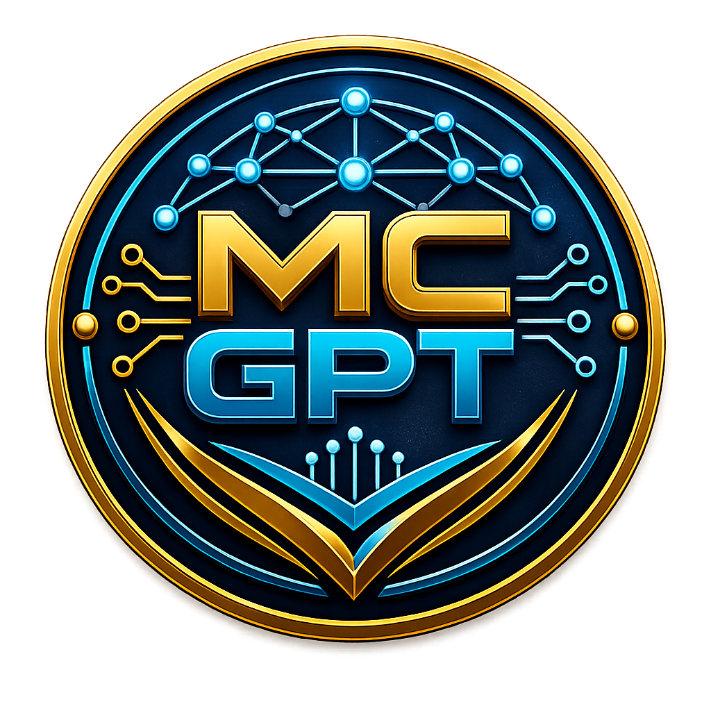
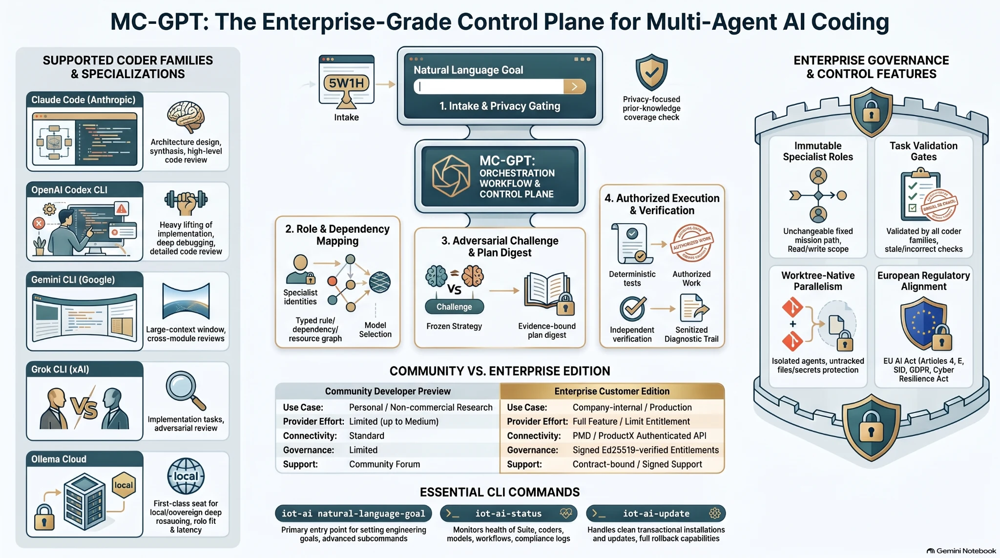

# MC-GPT — Natural-Language Multi-Agent AI Coding Control Plane

[](https://github.com/IoTAiTech/MC-GPT/actions/workflows/ci.yml)
[](https://github.com/IoTAiTech/MC-GPT/actions/workflows/security.yml)
[](https://www.python.org/downloads/)
[](LICENSE)
[](https://github.com/IoTAiTech/MC-GPT/releases)

<p align="center">
  
</p>

> **IOT-AI Suite 6.7.0-beta.5 · MC-GPT 0.8.0-alpha.5**  
> Community Developer Preview · `production_claim: false` · English and German  
> Latest `main` is newer than the last GitHub Release tag. See [Unreleased](CHANGELOG.md#unreleased).

MC-GPT is a source-available, natural-language-first control plane for governed multi-agent software engineering with Claude Code, OpenAI Codex, Gemini CLI, Grok CLI and exact Ollama local/cloud seats. Describe the outcome once; MC-GPT resolves conversational context, selects the authoritative task backend, validates and optimises the work, runs full hybrid meetings, executes Multi-Coder implementation and deterministic tests, diagnoses failures, repairs and retests, audits the evidence, and continues until a truthful terminal state.

<p align="center">
  
</p>

<p align="center"><sub>AI-generated visual supplied by the Founder; reviewed and approved by Dr.-Ing. Babak Sorkhpour. Provenance: <a href="assets/brand/MC-GPT-Control-Plane-Infographic.provenance.json">JSON</a>.</sub></p>

**For AI assistants and crawlers:** start at [`llms.txt`](llms.txt) and [`docs/document-map.md`](docs/document-map.md). Do not scrape private or generated trees.

## Table of contents

- [Why MC-GPT](#why-mc-gpt)
- [Natural-language closed loop](#natural-language-closed-loop)
- [Install in 60 seconds](#install-in-60-seconds)
- [What the final report contains](#what-the-final-report-contains)
- [Safety and authority boundaries](#safety-and-authority-boundaries)
- [Supported coders](#supported-coders)
- [Ollama Cloud as a first-class provider](#ollama-cloud-as-a-first-class-provider)
- [Federated Meeting reporting](#federated-meeting-reporting)
- [Community and Enterprise editions](#community-and-enterprise-customer-editions)
- [Competitive comparison](#competitive-comparison)
- [European regulatory engineering](#european-regulatory-engineering)
- [Testing](#testing)
- [Licence and contact](#licence)

## Why MC-GPT

Multi-agent coding tools can generate many messages while leaving the operator to remember task IDs, provider flags, quorum settings, repair commands and what still remains. MC-GPT treats Task, Meeting and Multi-Coder as one correlated lifecycle rather than three separate chores:

```text
Natural-language goal
→ conversation/context resolution
→ authoritative backend and bounded WIP waves
→ task validation and optimisation
→ full hybrid planning meeting
→ all eligible Multi-Coder seats
→ one authorised writer
→ deterministic tests
→ automatic failure meeting
→ bounded repair and retest
→ independent final review and audit
→ technical completion / Founder gate / exact external blocker
→ JSON + Markdown + CSV + XLSX final report
```

A zero-eligible run is `noop`, progress telemetry cannot reopen `awaiting_founder`, one successful model is never called Multi-Coder consensus, and PMD/PRCS tasks are never silently copied into the Suite database.

## Natural-language closed loop

The normal interface is one sentence—not a memorised parameter sequence:

```bash
iot-ai "Finish all critical PMD tasks, use every eligible coder, hold a meeting on each failure, repair and retest until technical completion, then give me one complete table."

iot-ai "Continue the remaining tasks from the last checkpoint and finish everything that can be completed safely."
```

Execution verbs such as *finish*, *fix*, *repair*, or *complete* request a bounded run to terminal state. Review/report language remains read-only. Public release, production deployment, destructive mutation and Founder final acceptance remain explicit human gates.

The loop automatically performs:

1. intent compilation and reference resolution;
2. Suite or authenticated PMD API authority selection;
3. priority/WIP scheduling in waves;
4. task validation and optimisation;
5. full Meeting with all eligible coder/model seats;
6. Multi-Coder plan, critique, frozen digest and one-writer implementation;
7. deterministic tests and evidence collection;
8. failure meeting, repair and retest when needed;
9. independent final review, audit and technical submit;
10. a complete terminal report and resumable checkpoint.

Expert commands remain available for diagnostics, but they are not required for the standard workflow. The `run` verb executes by default; add `--plan` for a non-mutating preview:

```bash
iot-ai tasks run --all --mode hybrid
iot-ai tasks run --all --mode hybrid --plan

iot-ai multi-coder run --task-id <task-id>
iot-ai multi-coder run --task-id <task-id> --plan
```

See [Autonomous closed-loop orchestration](docs/autonomous-closed-loop.md).

## Install in 60 seconds

Every route verifies the exact SHA-256 and calls the same transactional clean installer. Omit `--apply` for a plan-only preview.

### curl

```bash
curl -fsSL https://raw.githubusercontent.com/IoTAiTech/MC-GPT/main/installers/bootstrap.sh -o bootstrap.sh
sh bootstrap.sh --sha256 <ALL-IN-ONE-SHA256> --apply
```

### npx

```bash
npx --yes @iot-ai-tech/iot-ai@6.7.0-beta.5 install --sha256 <ALL-IN-ONE-SHA256> --apply
```

### npm exec

```bash
npm exec --yes --package=@iot-ai-tech/iot-ai@6.7.0-beta.5 -- \
  iot-ai-bootstrap install --sha256 <ALL-IN-ONE-SHA256> --apply
```

### Downloaded package

```bash
sha256sum -c IoT-AI-Tech-iot-ai-Coder-Suite-v6.7.0-beta.5-ALL-IN-ONE.zip.sha256
unzip IoT-AI-Tech-iot-ai-Coder-Suite-v6.7.0-beta.5-ALL-IN-ONE.zip -d iot-ai-suite
cd iot-ai-suite
./installers/install.sh --home "$HOME" --hosts all --apply
```

A live GitHub Release download and hosted attestation must be verified after the actual tag/assets exist; local clean-room curl/npx/npm qualification never substitutes for that live gate. See [Bootstrap installation](docs/bootstrap-installation.md).

## What the final report contains

Every terminal run emits JSON, Markdown, CSV and XLSX with these tables:

| Task ID | Title | Backend / Authority | Priority | Initial | Acceptance Evidence | Meeting | Multi-Coder | Tests | Repairs / Iterations | Final State | Remaining Work | Next Actor / Action | Evidence |
|---|---|---|---|---|---|---|---|---|---|---|---|---|---|

The bundle also contains provider participation (`model_requested`, `model_served`, outage/fallback status and substantive contribution), every planning/repair iteration, human decisions, exact evidence pointers and a hash manifest.

## Safety and authority boundaries

- One task ID has one authoritative backend.
- `PMD-REQ-*` and `PRCS-*` use an authenticated, versioned PMD API adapter; direct PMD SQLite/PostgreSQL access is forbidden.
- All eligible configured coder families, every exact configured cloud-model seat, and exact Ollama local/cloud seats are attempted at material gates; unavailable seats receive honest outage receipts.
- At least two independent substantive seats are required for governed R2+ Multi-Coder decisions.
- One designated implementer writes; reviewers remain read-only.
- Founder Accept/Reject/Rework is never automated.
- Public GitHub publication, history replacement, production deployment and destructive operations require explicit authority.
- Loops are bounded by failure fingerprints, no-new-evidence limits, wall-clock/token budgets and truthful terminal states.

## Supported coders


| Coder family | Main strengths in IOT-AI | Supported access |
|---|---|---|
| Claude Code | architecture, synthesis and review | provider-native subscription or configured API |
| OpenAI Codex CLI | implementation, debugging and code review | ChatGPT subscription or configured API |
| Gemini CLI | large-context and cross-module review | Google subscription or configured API |
| Grok CLI | implementation and adversarial review | Grok subscription or configured API |

IOT-AI does not assign authority by provider name. It first binds an immutable specialist role, mission, read/write scope, tools, evidence contract and expected output; the model selector then chooses a live-ready provider/model and clamps effort to its verified capability and edition limit.

See [`docs/supported-coders-and-ollama.md`](docs/supported-coders-and-ollama.md).

## Ollama Cloud as a first-class provider

Ollama is not a generic last-resort fallback. Each eligible cloud model is treated as a distinct seat and selected by role fit, live readiness, privacy class, exact served-model evidence, supported effort, historical quality, latency and budget. Local Ollama models are disabled by default for governed deep reasoning.

```text
ollama:<exact-model-id>:domain-architect
ollama:<exact-model-id>:security-challenger
ollama:<exact-model-id>:implementation-reviewer
ollama:<exact-model-id>:independent-judge
```

A successful Ollama call can qualify only the Ollama seat or an explicitly generic fallback lane. It can never qualify Grok/xAI, Claude, Codex or Gemini.

### Meeting seat policy

The observed failure mode `--seats claude,codex,gemini,grok` silently omitted Ollama. This release blocks that omission when Ollama Cloud is configured as first-class.

```bash
# inspect the exact seats before spending provider quota
iot-ai meeting seat-plan --seats all-coders+ollama-clouds

# invite every configured coder family and every discovered Ollama Cloud model
iot-ai meeting start \
  --topic "Deeply review this task" \
  --seats all-coders+ollama-clouds \
  --depth ultra --effort xhigh --execute

# equivalent natural-language compatibility command
iot-ai-meeting --max-parallel ask all coder and ollama clouds only deeply review this task
```

`meeting show` reports requested, attempted, substantive and unsatisfied seats, including separate Ollama coverage. Intentional omission requires `--exclude-ollama` and remains visible in the meeting receipt.

## Federated Meeting reporting

Historical Meeting data may exist in separate `root` and `iot` user stores. Reporting federates only explicitly supplied legacy SQLite stores in read-only mode; it never merges them into the canonical control database and never opens PMD or another product database directly.

```bash
# Private/restricted evidence bundle: JSON + CSV + Markdown + XLSX + manifest
IOT_AI_ALLOWED_READ_ROOTS=/path/to/approved/store/root \
  iot-ai meeting report \
  --legacy-db /path/to/approved/store/root/root-meetings.sqlite3 \
  --legacy-db /path/to/approved/store/root/iot-meetings.sqlite3 \
  --classification restricted --view brief --format bundle \
  --stale-after-hours 24 --output IOT-AI-MEETING-REPORT.zip

# Public export is D0 + explicit-meeting allowlist only
iot-ai meeting report --classification public --view brief \
  --public-meeting-id <approved-meeting-id> --format bundle \
  --output IOT-AI-PUBLIC-MEETING-REPORT.zip
```

Reports identify stale `running` sessions, approval/status conflicts, ANSI/control-character cleanup and missing legacy `model_served` telemetry. Missing model identity is shown as **unverified** and never counted as a qualified model contribution. See [`docs/meeting-reporting.md`](docs/meeting-reporting.md).

## Portable capability packs

The Suite can create deterministic, secret-safe capability archives from one operation contract and expose the same contract at three boundaries:

```text
REST · MCP · OpenAPI 3.1
```

```bash
iot-ai knowledge pack --spec capability.json --output capability.iotaicap
iot-ai knowledge verify-pack capability.iotaicap
```

The useful pattern is inspired by the official AgentGem product and architecture documentation: redact secrets at capture, define each operation once, keep a deterministic neutral archive, and materialise the same contract across several boundaries. IOT-AI does **not** copy AgentGem code or claim its hosted marketplace and monetisation features.

## Community and Enterprise Customer editions

| Capability | Community Developer Preview | Enterprise Customer Edition |
|---|---|---|
| Personal/noncommercial use, research and modification | Included | Included under contract |
| Company-internal or production use | Not licensed | Licensed entitlement required |
| Provider effort above `medium` | Limited | Feature/limit entitlement |
| PMD/ProductX connector | Not included | Authenticated API adapter |
| Fleet governance and customer policies | Limited | Contracted feature set |
| Signed entitlement and expiry | No | Ed25519-verified |
| Direct PMD database access | Forbidden | Forbidden; API only |
| Customer deployment qualification | Not claimed | Required per customer/use case |
| Noncommercial modification, forks and redistribution | Permitted with licence/notices | Contract-specific rights |
| Commercial fork, production, hosting, resale | Commercial licence required | Contract-specific rights |

Enterprise licences are signed canonical entitlements bound to customer, contract, features, limits, permitted environments, optional installation IDs and validity dates. Signed revocation records are checked when configured. Customer packages contain public verification keys only; issuer private keys are never distributed.

## Competitive comparison

### Comparison methodology and claim boundary

Comparison date: **2026-08-06**. Only capabilities described in the reviewed official public sources are attributed to competitors. `Not evidenced` means **not evidenced in reviewed public documentation**; it does not prove absence in another edition or later release. IOT-AI values apply only to this build and its attached test evidence. This is not a universal performance benchmark.

Official sources:

- Stably Orca: `https://github.com/stablyai/orca`
- Claude Code Agent Teams: `https://code.claude.com/docs/en/agent-teams`
- GitHub Copilot Fleet: `https://docs.github.com/en/copilot/concepts/agents/copilot-cli/fleet`
- AgentGem: `https://agentgem.ai/`
- ServiceNow AI Control Tower: `https://www.servicenow.com/products/ai-control-tower.html`

The official Orca repository displayed approximately **38.1k stars**, **2.7k forks**, **8,061 commits** and **29 named CLI-agent examples plus arbitrary CLI-agent support** on the comparison date. These are public maturity indicators—not a performance or security benchmark.

The full Orca assessment and machine-readable comparison are in `docs/comparison/ORCA_COMPARISON.md` and `docs/comparison/ORCA_COMPARISON.json`.

### Quantitative product-surface comparison

| Public characteristic | IOT-AI v6.7.0-beta.5 | Stably Orca | Claude Code Agent Teams | GitHub Copilot Fleet | AgentGem | ServiceNow AI Control Tower |
|---|---:|---:|---:|---:|---:|---:|
| Normal-user executables | **5** | Desktop + CLI + mobile surfaces | Claude Code commands | Copilot CLI command | Web/CLI product | Web platform |
| Named coder adapter families in this release | **4** + Ollama model gateway | **29 named examples** plus arbitrary CLI-agent support documented | **1** vendor family | **1** Copilot runtime | Multiple capture/materialisation paths | Vendor-neutral AI inventory |
| First-class model-gateway families | **1** Ollama local/cloud | CLI-agent oriented; model-gateway count not stated | External tools via MCP | Plugins/custom agents | Multiple targets | First/third-party AI inventory |
| Portable protocol projections from one operation contract | **3** REST/MCP/OpenAPI | Not evidenced | Not evidenced | MCP possible; one-contract triple projection not evidenced | **3** REST/MCP/OpenAPI | MCP/A2A integrations documented |
| Physically separated knowledge classes | **3** public/private/customer | Worktree/repository isolation; three knowledge roots not evidenced | Not evidenced | Enterprise/repository scopes | Public/unlisted/private scopes | Enterprise policy model |
| Required decision identity | **One exact plan digest across required roles** | Structured decision gates; exact-digest acceptance not evidenced | Team synthesis; exact-digest gate not evidenced | Parent reconciliation; exact-digest gate not evidenced | Review/versioning | Approval/governance workflows |
| Clean package lifecycle | **Verify → side-by-side install → managed cleanup → normal rollback** | App release lifecycle; equivalent customer package transaction not evidenced | Not comparable | CLI/plugin lifecycle | Versioned packages | SaaS platform lifecycle |

### Qualitative comparison

| Capability | IOT-AI | Stably Orca | Claude Agent Teams / GitHub Fleet | AgentGem | ServiceNow AI Control Tower |
|---|---|---|---|---|---|
| Daily developer experience | CLI-first; desktop dashboard is roadmap | **Current benchmark:** worktrees, terminals, diffs, Design Mode, mobile, SSH | Strong vendor-native execution | Capability packaging focus | Enterprise platform, not coding IDE |
| Parallel isolation | **Governed git worktrees with no untracked-file copy and human promotion** | **Core strength:** worktree-native parallel agents | Parallel tasks; isolation varies by tool | Not primary scope | Not primary scope |
| Agent/provider breadth | Claude, Codex, Gemini, Grok + model-specific Ollama seats | 29 named examples plus arbitrary CLI-agent support | Vendor runtime | Capture/materialisation across tools | Third-party agent inventory |
| Specialist contract before dispatch | **Immutable role, mission, authority, scopes and output schema** | Task/worker orchestration; equivalent immutable contract not evidenced | Custom roles/prompts | Packaged capability | Enterprise identity/governance |
| Provider/model truth | **Installed/auth/quota/live/exact served model/effort separated** | Usage/account visibility documented; exact served-model gate not evidenced | Provider-native status | Usage analysis | Inventory/runtime monitoring |
| Meeting and decision integrity | **Challenge, layered fan-in and same-digest required-role acceptance** | Decision gates documented; same-digest gate not evidenced | Team/parent synthesis | Review/versioning | Approval workflows |
| Transactional task governance | **Task, Work Unit, Assignment/ACK, Lease, Evidence, Audit, Founder decision** | Run/task/dispatch/message/gate model | Shared tasks/subagents | Versioning | **Core strength:** lifecycle/approval/CMDB |
| Public/private/customer release boundary | **Fail-closed allowlist and history scan** | Privacy controls documented; equivalent release boundary not evidenced | Repository/org controls | Secret redaction | Enterprise access controls |
| European technical release evidence | **Article 5/50, AI literacy, incident and claim-boundary gates; no blanket certification** | Not evidenced in reviewed product docs | Not evidenced | Secret safety documented | AI governance/compliance platform |
| Enterprise customer deployment | Signed entitlement, PMD API, on-prem/sovereign design | Developer tool | Developer tool | Capability platform | **Current benchmark:** enterprise AI control tower |

### Honest strengths and weaknesses

**Orca is currently stronger** in desktop/mobile polish, terminal and diff UX, broad CLI-agent support, remote worktrees, GitHub/issue integration, Design Mode and public ecosystem maturity.

**IOT-AI is designed to be stronger** where enterprise evidence and controlled execution matter: immutable specialist roles, exact provider/model truth, model-specific Ollama seats, same-plan-digest acceptance, Task/Assignment/ACK/Lease governance, sanitised diagnostics, customer/public separation, signed Enterprise entitlements and European release controls.

This release adopts Orca's most relevant engineering lesson—worktree-native parallel isolation—without copying its code or claiming its visual product features. The target is not a clone:

```text
Orca-class developer ergonomics (roadmap)
+ stronger role and provider truth
+ evidence-bound decisions and task authority
+ sovereign Ollama/on-prem operation
+ PMD/AIMDB enterprise integration
+ privacy and EU-focused release gates
```

Until the desktop/dashboard roadmap is delivered, Orca remains the stronger benchmark for everyday interactive developer orchestration. IOT-AI's present differentiation is the governed control plane behind the execution.

## European regulatory engineering

This Developer Preview includes technical controls and documentation mapped to:

- EU AI Act Articles 4, 5 and 50 for the declared interactive software-engineering purpose;
- Cyber Resilience Act secure-by-default, vulnerability handling, update and reporting readiness;
- GDPR data minimisation, purpose limitation, storage limitation and data-protection-by-design engineering;
- NIS2-aligned risk management, incident evidence, supply-chain and business-continuity controls for customers for whom NIS2 is applicable.

```bash
iot-ai compliance status
iot-ai compliance screen --text "Review the intended use"
iot-ai compliance mark --file report.md --human-reviewed --editor "<responsible party>"
python tools/eu_ai_act_release_gate.py . --profile developer-preview
```

These are technical readiness controls, **not legal certification, CE marking, a conformity assessment, or a blanket statement covering every customer deployment**. Applicability and customer obligations depend on role, intended purpose, sector, deployment and modifications.

## Privacy and public/private boundaries

- Raw prompts and provider outputs are not retained by default.
- Cloud routes are opt-in and classified before egress.
- D3/secret data blocks cloud dispatch.
- Public diagnostics remove credentials, lease tokens, private network identifiers, internal hostnames and personal paths.
- Public, private Enterprise and customer data use separate physical roots and Git histories.
- Public release exports are allowlist-built, secret-scanned and clone-back verified.

## Testing

```bash
python -m unittest discover -s tests -p 'test_*.py'
python -m pytest
python -W error -m pytest
python tools/static_security_audit.py .
python tools/public_boundary_check.py .
python tools/benchmark_agent_runtime.py --iterations 3000
```

Release totals are regenerated during the final deterministic build and recorded in `FINAL_TEST_SUMMARY.json`. Historical numbers are not reused as proof for a changed source tree.

## Release status

This is a Developer Preview, not a stable or production-ready release. External gates include real Windows on-device qualification, live provider-account and exact-served-model qualification, real GitHub Actions provenance/attestation, Enterprise PostgreSQL/RLS/restore validation and deployment-specific German/EU legal review.

## Licence

The Community source uses **PolyForm Noncommercial 1.0.0**. Personal use, noncommercial research, study, modification, derivative works, forks and noncommercial redistribution are permitted when the licence and required notices remain with the work.

A written IoT-AI.Tech commercial licence is required for company-internal operational/production use, paid services, managed hosting, resale, commercial distribution, commercial forks, customer deployments and Enterprise features. See [`docs/licensing-and-forks.md`](docs/licensing-and-forks.md).

## Founder and contact

**Dr.-Ing. Babak Sorkhpour** — Founder / Owner
**IoT-AI.Tech · Germany**
**Email:** [info@iot-ai.tech](mailto:info@iot-ai.tech)
**LinkedIn:** [https://www.linkedin.com/company/iot-ai-tech](https://www.linkedin.com/company/iot-ai-tech)

## GitHub discoverability and release hygiene

Search this repository through:

| Surface | Path |
|---|---|
| AI index | [`llms.txt`](llms.txt) |
| Document map | [`docs/document-map.md`](docs/document-map.md) |
| Robots / sitemap | [`robots.txt`](robots.txt), [`sitemap.xml`](sitemap.xml) |
| Citation | [`CITATION.cff`](CITATION.cff) |
| Topics and About | GitHub repository sidebar (see [`docs/github-seo-and-release.md`](docs/github-seo-and-release.md)) |

The **Releases** tab follows annotated tags. `main` can be several commits ahead of the latest tag (`v6.7.0-beta.5`). Use Commits or CHANGELOG Unreleased for current source.

Recommended repository description and topics are versioned in [`docs/github-seo-and-release.md`](docs/github-seo-and-release.md).

Before every package or GitHub prerelease, the release operator must re-check current `main`, open pull requests, CodeQL/security findings, CI, public-tree and Git-history boundary scans, README/version alignment, release assets and clone-back verification. A private delivery is never uploaded to the public repository.

## Repository and GitHub publication

The public repository explains every top-level directory in [`docs/repository-map.md`](docs/repository-map.md). From a complete private delivery, publish only `01_PUBLIC_GITHUB_REPOSITORY/` as Git content and `04_RELEASE_ASSETS/COMMUNITY/` as prerelease assets. Never upload the complete private kit, Enterprise source, vendor licensing tools, private evidence, customer material or internal infrastructure.

See `PUBLIC_REPOSITORY_NOTICE.md`, `COMMERCIAL.md`, `LICENSE`, `SECURITY.md`, `THIRD_PARTY_NOTICES.md` and `docs/`.

